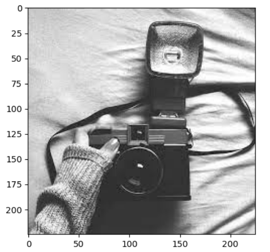
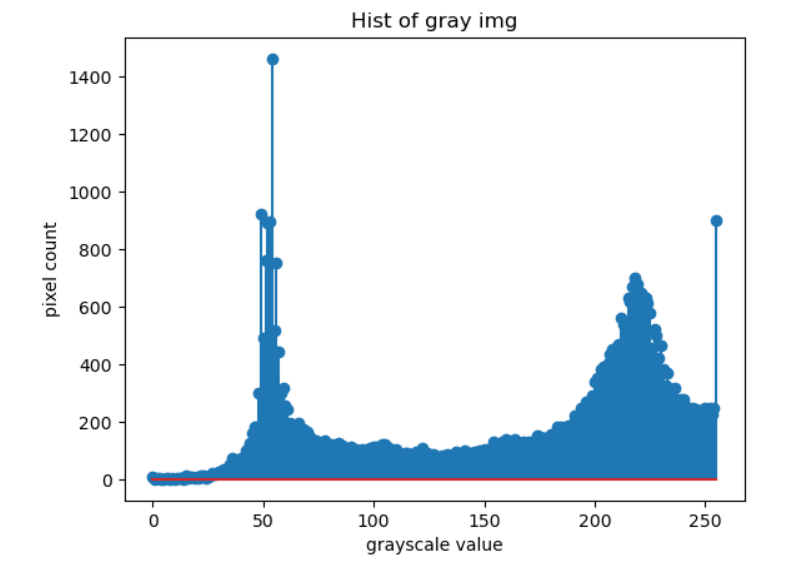
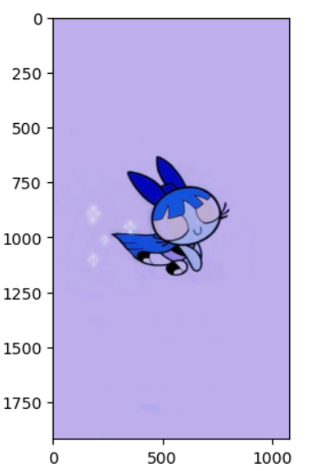
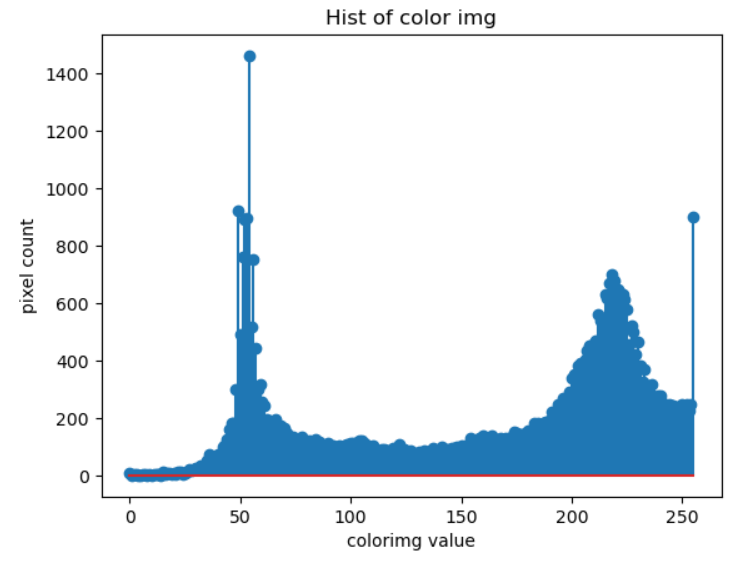
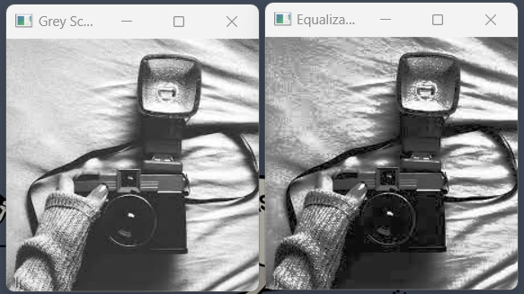

# Histogram and Histogram Equalization of an image
## Aim
To obtain a histogram for finding the frequency of pixels in an Image with pixel values ranging from 0 to 255. Also write the code using OpenCV to perform histogram equalization.

## Software Required:
Anaconda - Python 3.7

## Algorithm:
### Step1:
Read the gray and color image using imread()
### Step2:
Print the image using imshow().
### Step3:
Use calcHist() function to mark the image in graph frequency for gray and color image.
### Step4:
cv2.equalize() is used to transform the gray image to equalized form.
### Step5:
The Histogram of gray scale image and color image is shown.

## Program:
### Developed By: Meenakshi M
### Register Number: 212221230057
```py
import cv2
import matplotlib.pyplot as plt
```

### Write your code to find the histogram of gray scale image and color image channels.
```py
gray_image=cv2.imread("bw.jpeg")
plt.imshow(gray_image)
plt.show()

hist_gray_img=cv2.calcHist([gray_image],[0],None,[256],[0,256])
plt.figure()
plt.title("Hist of gray img")
plt.xlabel("grayscale value")
plt.ylabel("pixel count")
plt.stem(hist_gray_img)
```

### Display the histogram of gray scale image and any one channel histogram from color image
```py
color_image=cv2.imread("ppg.jpg")
plt.imshow(color_image)
plt.show()

hist_gray_img=cv2.calcHist([gray_image],[0],None,[256],[0,256])
plt.figure()
plt.title("Hist of color img")
plt.xlabel("colorimg value")
plt.ylabel("pixel count")
plt.stem(hist_gray_img)
```

### Write the code to perform histogram equalization of the image. 
```py
gs_img=cv2.imread("bw.jpeg",0)
equ=cv2.equalizeHist(gs_img)
cv2.imshow("Grey Scale",gs_img)
cv2.imshow("Equalization",equ)
cv2.waitKey(0)
cv2.destroyAllWindows()
```

## Output:
## Input Grayscale Image and Color Image



## Histogram of Grayscale Image and any channel of Color Image



## Histogram Equalization of Grayscale Image


## Result: 
Thus the histogram for finding the frequency of pixels in an image with pixel values ranging from 0 to 255 is obtained. Also,histogram equalization is done for the gray scale image using OpenCV.
